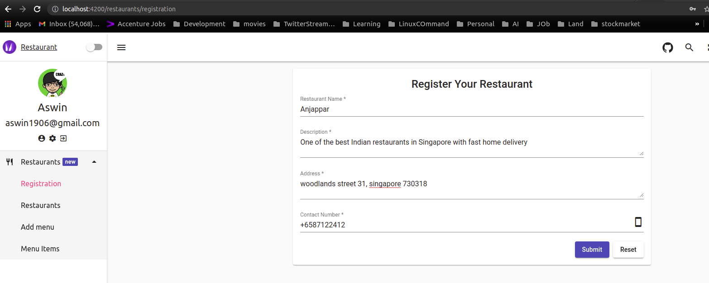
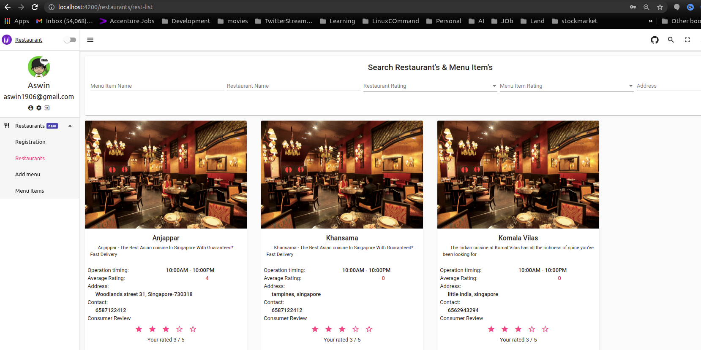
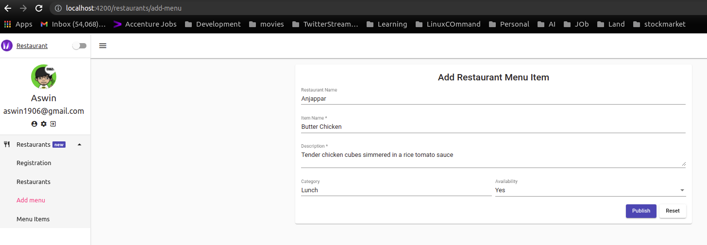
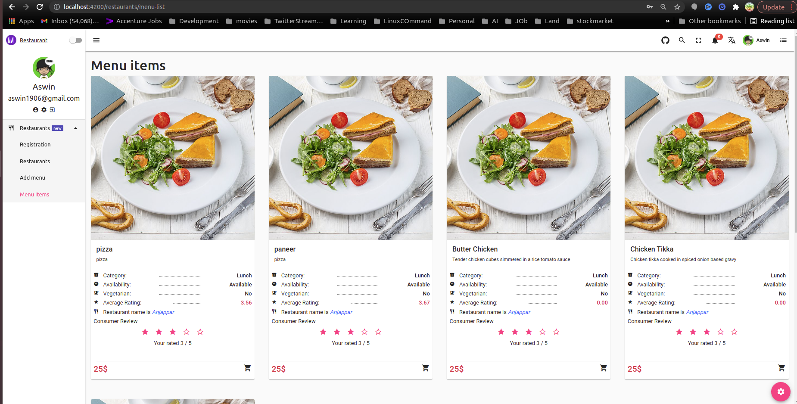
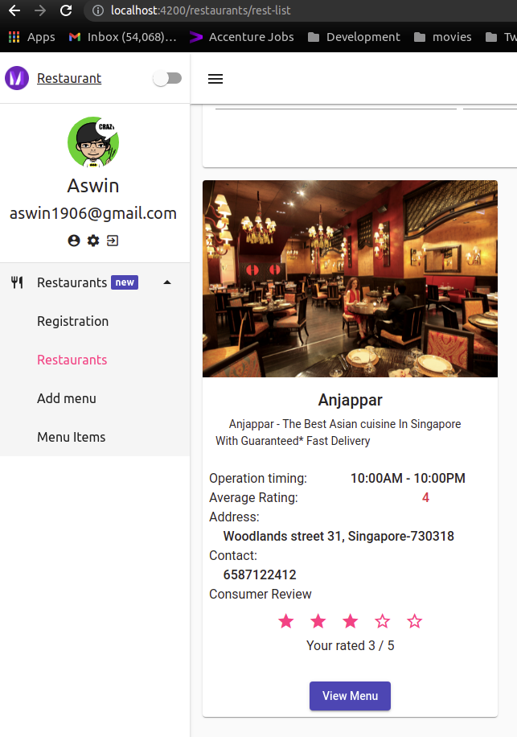

### Restaurant Management

Restaurant management using Angular, Nodejs and MongoDB

#### Prerequisites:

- node v12.0.0
- angular v11.1.0
- mongoDB v3.6.18
- @angular/material v11.1.0
- bootstrap v5.0.2
- angular/router v11.1.0
- Refer the module source code directory path at `./client/src/app/routes/restaurants` for client and `./server/app/controllers/restaurants` for server

#### How to Run:

- Got to client & server directory to install all modules first by typing `npm install` or `yarn add`

- to run it please type `npm start` for both client & server
- Access Url http://localhost:4200/restaurants/registration 0r http://localhost:4200

## ✨ Features

Landing Page or Restaurant Registration

Search Registered Restaurant using Menu Item, Restaurant Name, Menu rating, Restaurant rating & location

Publish Menu Item For Each Restaurant

Find All MenuItems based on restaurant and click star for menu rating

Go to menu items by clicking `View Menu` button and you can click star for rating for restaurant

## 📃 License

MIT
